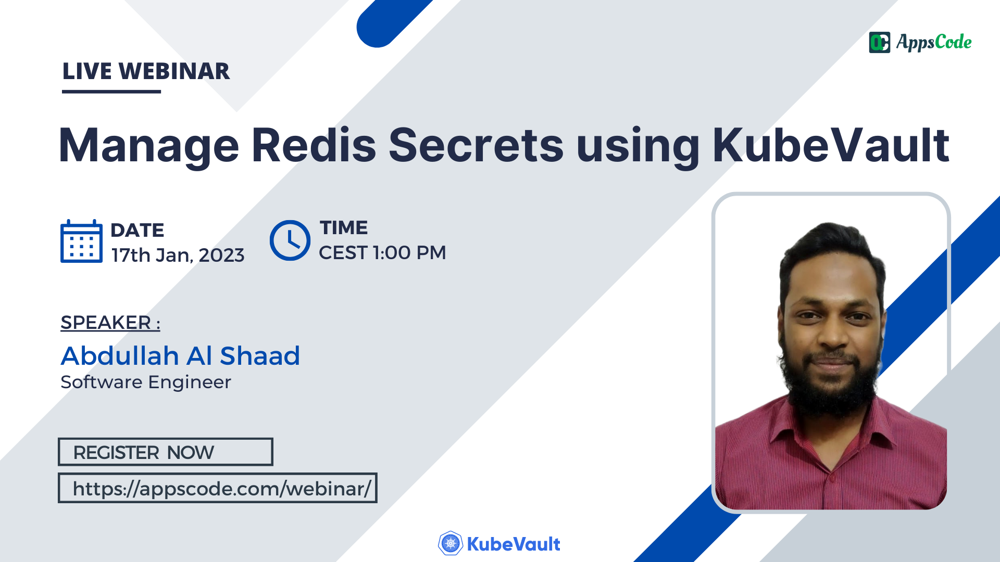

# AppsCode Webinar 01-12-22

<p class="has-text-centered">
  
</p>

# Secure Secrets: A Cloud-Native Approach Made Simple With KubeVault

---

## Install KubeDB Enterprise operator chart

```bash
helm install kubedb appscode/kubedb \
        --version v2022.12.28 \
        --namespace kubedb --create-namespace \
        --set kubedb-provisioner.enabled=true \
        --set kubedb-ops-manager.enabled=true \
        --set kubedb-autoscaler.enabled=true \
        --set kubedb-dashboard.enabled=true \
        --set kubedb-schema-manager.enabled=true \
        --set-file global.license=/path/to/license.txt
```

## Install KubeVault Enterprise operator chart

```bash
$ helm install kubevault appscode/kubevault \
    --version v2022.12.28 \
    --namespace kubevault --create-namespace \
    --set-file global.license=/path/to/the/license.txt
```

## Install Secret-store CSI Driver

```bash
$ helm install csi-secrets-store secrets-store-csi-driver/secrets-store-csi-driver --namespace kube-system
```

## Install Vault specific CSI Provider

```bash
# using helm
$ helm install vault hashicorp/vault \
    --set "server.enabled=false" \
    --set "injector.enabled=false" \
    --set "csi.enabled=true"
    
```

## Deploy VaultServer

```bash
# deploy the vault server
$ kubectl apply -f vaultserver.yaml
```

## Export necessary environment variables

```bash
$ export VAULT_ADDR=http://127.0.0.1:8200

$ export VAULT_TOKEN=(kubectl vault root-token get vaultserver vault -n demo --value-only)
```

## Get decrypted Vault Root Token

```bash
# get the decrypted root token with name
$ kubectl vault root-token get vaultserver vault -n demo

# get only the value of decrypted root token
$ kubectl vault root-token get vaultserver vault -n demo --value-only
```

## Enable Redis SecretEngine

```bash
# create redis DB 
$ kubectl apply -f redis.yaml

# enable secret engine
$ kubectl apply -f secretengine.yaml
```

## Create Database Roles

```bash
# create the superuser role
$ kubectl apply -f write-read-role.yaml

# create the readonly role
$ kubectl apply -f read-role.yaml
```

## Create SecretAccessRequest

```bash
# create accessrequest for write-read-role
$ kubectl apply -f write-read-access-req.yaml

# create accessrequest for read-role
$ kubectl apply -f read-access-req.yaml
```

## Approve/Deny SecretAccessRequest

```bash
# upon approval of secret access request, secrets with username/password will be created
$ kubectl vault approve secretaccessrequest write-read-access-req -n dev

$ kubectl vault approve secretaccessrequest read-access-req -n dev

# deny secret access request
$ kubectl vault deny secretaccessrequest read-access-req -n dev
```
## Secure Microservice using Dynamic Secrets
This microservice will use the dynamically generated credentials (username, password) which will be mounted on the provided directory & these credentials bound the users to the specific roles in the database.

## Create ServiceAccount & SecretRoleBinding

```bash
# create the service account
$ kubectl apply -f sa/serviceaccount.yaml

# create the secret role binding
$ kubectl apply -f secret-role-binding.yaml
```

## Create SecretProviderClass using KubeVault CLI
```bash
# Generate secretproviderclass for the Redis username and password
$ kubectl vault generate secretproviderclass vault-db-provider -n app      \
    --secretrolebinding=dev/secret-role-binding \
    --vaultrole=RedisRole/read-role \
    --keys username=redis-creds-username --keys password=redis-creds-password -o yaml 

# Get SecretPath from Vault Policy    
$ kubectl get vaultpolicy -n demo srb-dev-secret-role-binding -oyaml    

# Apply generate yaml or custom yaml to create secretproviderclass
$ kubectl apply -f secret-provider-class.yaml
```

## Deploy the Microservice 

```bash
# create a microservice pod
$ kubectl apply -f app.yaml
```

## Revoke the SecretAccessRequest

```bash
$ kubectl vault revoke secretaccessrequest write-read-access-req -n dev
```

## Delete the VaultServer

```bash
# TerminationPolicy WipeOut will clean-up the unseal keys & root token 
$ kubectl delete -f vaultserver.yaml
```

## Redis Queries

```bash
# login as the root user
$ redis-cli

# login using the username, password
$ auth <username> <password>

# set key
$ set hello world

# get key
$ get hello 

# list users ( admin )
$ acl list 
```