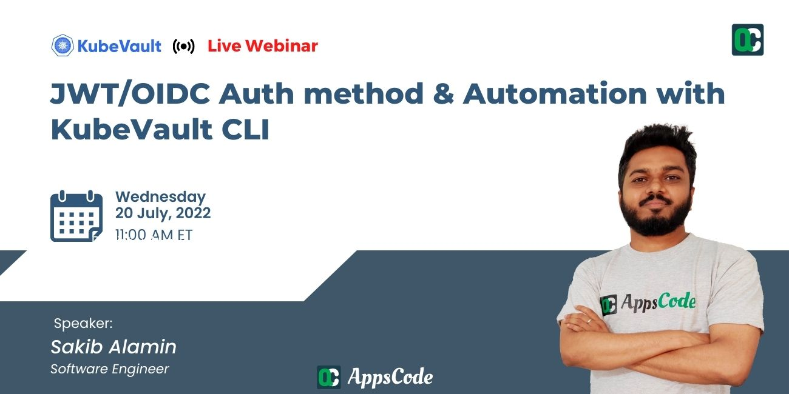

# AppsCode Webinar 07-20-22

<p class="has-text-centered">
  
</p>

# JWT/OIDC Auth method & Automation with KubeVault CLI

---

## Install KubeDB Enterprise operator chart

```bash
$ helm install kubedb appscode/kubedb \
    --version v2022.05.24 \
    --namespace kubedb --create-namespace \
    --set kubedb-enterprise.enabled=true \
    --set kubedb-autoscaler.enabled=true \
    --set-file global.license=/path/to/the/license.txt
```

## Install KubeVault Enterprise operator chart

```bash
$ helm install kubevault appscode/kubevault \
    --version v2022.06.16 \
    --namespace kubevault --create-namespace \
    --set-file global.license=/path/to/the/license.txt
```

## Install Secret-store CSI Driver

```bash
$ helm install csi-secrets-store secrets-store-csi-driver/secrets-store-csi-driver --namespace kube-system
```

## Install Vault specific CSI Provider

```bash
# using helm
$ helm install vault hashicorp/vault \
    --set "server.enabled=false" \
    --set "injector.enabled=false" \
    --set "csi.enabled=true"
     
# or using provider yaml
$ kubectl apply -f provider.yaml
```

## Create JWT/OIDC secret

```bash
# contains the oidc provider client secret
$ kubectl apply -f oidc-cred.yaml 
```

## Deploy VaultServer

```bash
# deploy the vault server
$ kubectl apply -f vaultserver.yaml
```

## Export necessary environment variables

```bash
$ export VAULT_ADDR='https://127.0.0.1:8200'

$ export VAULT_SKIP_VERIFY=true

$ export VAULT_TOKEN=(kubectl vault get-root-token vaultserver vault -n demo --value-only) 
```

## Check the enabled authentication methods

```bash
$ vault auth list
Path           Type          Accessor                    Description
----           ----          --------                    -----------
kubernetes/    kubernetes    auth_kubernetes_9bac811f    n/a
oidc/          oidc          auth_oidc_539b7c3b          n/a
token/         token         auth_token_70ae1cc9         token based credentials
```

## Create VaultPolicy

```bash
$ kubectl apply -f policy.yaml
```

# Create VaultPolicyBinding

```bash
$ kubectl apply -f policybinding.yaml
```

## Enable MongoDB SecretEngine

```bash
# create mongoDB 
$ kubectl apply -f mongodb.yaml

# enable secret engine
$ kubectl apply -f secretengine.yaml
```

## Create Database Roles

```bash
# create the mongo superuser role
$ kubectl apply -f mongo-superuser-role.yaml
```

## Create SecretAccessRequest

```bash
$ kubectl apply -f secretaccessrequest.yaml
```

## Create ServiceAccount

```bash
# create the service account
$ kubectl apply -f serviceaccount.yaml
```

## Approve/Deny/Revoke SecretAccessRequest

```bash
# upon approval of secret access request, secrets with username/password will be created
$ kubectl vault approve secretaccessrequest mongo-cred-req -n dev

# deny secret access request
$ kubectl vault deny secretaccessrequest mongo-cred-req -n dev

# revoke secret access request
$ kubectl vault revoke secretaccessrequest mongo-cred-req -n dev
```

## Create SecretRoleBinding

```bash
# create the secret role binding
$ kubectl apply -f secretrolebinding.yaml
```

## Create SecretProviderClass using KubeVault CLI

```bash
# Generate secretproviderclass for the MongoDB username and password
$ kubectl vault generate secretproviderclass mongo-secret-provider -n test      \
    --secretrolebinding=dev/secret-r-binding \
    --vaultrole=MongoDBRole/mongo-superuser-role \
    --keys username=sql-user --keys password=sql-pass -o yaml 
```

## Kubectl Vault commands

```bash
# get the decrypted vault-root-token
$ kubectl vault root-token get vaultserver -n demo vault
k8s.kubevault.com.demo.vault-root-token: hvs.I36C6SucvJEWKaZz6I2odK7D

# get only the value of decrypted vault-root-token
$ kubectl vault root-token get vaultserver -n demo vault --value-only
hvs.I36C6SucvJEWKaZz6I2odK7D

# list the vault-unseal-keys
$ kubectl vault unseal-key list vaultserver -n demo vault
k8s.kubevault.com.demo.vault-unseal-key-0: 34df60195991cb6ffc99f0f59f5064f6b31c9af0bd65b518b6e7d10364d50eaef7
k8s.kubevault.com.demo.vault-unseal-key-1: 93841c9c670b48eb950033580597ab08ac1b5cee4ce8a1091db6eefe6dde8ba164
k8s.kubevault.com.demo.vault-unseal-key-2: a1c042c148ccba09bb1dd580c2bb081b360bcfcbc03a6eb36a187e375d8bd63e93

# delete vault-unseal-key with a key-name
$ kubectl vault unseal-key delete vaultserver vault -n demo --key-name <vault-unseal-key-name>

# sync old values to newer ones
$ kubectl vault root-token sync vaultserver -n demo vault
$ kubectl vault unseal-key sync vaultserver -n demo vault

# Approve/Deny/Revoke SecretAccessRequest
$ kubectl vault approve secretaccessrequest -n dev mongo-cred-req
$ kubectl vault deny secretaccessrequest -n dev mongo-cred-req
$ kubectl vault revoke secretaccessrequest -n dev mongo-cred-req

# generate SecretProviderClass
$ kubectl vault generate secretproviderclass mongo-secret-provider -n test      \
  --secretrolebinding=dev/secret-r-binding \
  --vaultrole=MongoDBRole/mongo-superuser-role \
  --keys username=mongo-user --keys password=mongo-pass -o yaml
```