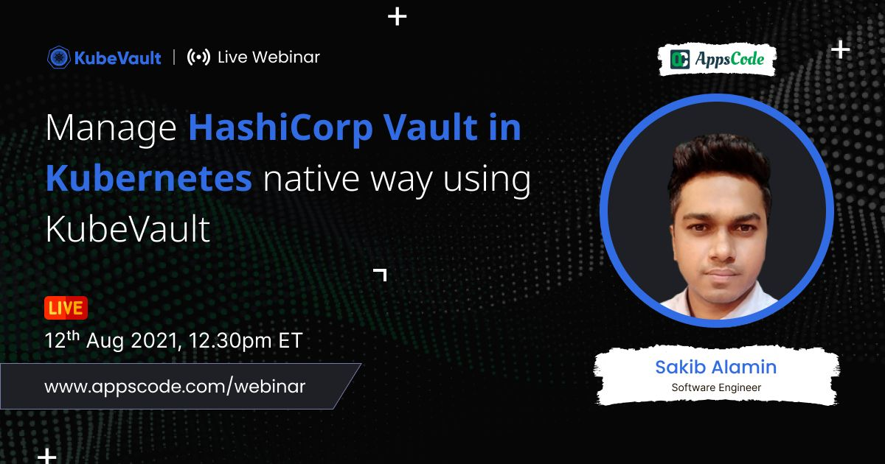

## AppsCode Webinar 08-12-21
<p class="has-text-centered">
  
</p>
### Manage HashiCorp Vault in Kubernetes native way using [KubeVault](https://kubevault.com/)

---
### install kubedb-enterprise operator
Deploy `KubeDB` enterprise in the `kube-system` namespace.
```bash
$ helm install kubedb appscode/kubedb \
      --version v2021.06.23 \
      --namespace kube-system \
      --set-file global.license=/path-to-kubedb-license/db-license.txt \
      --set kubedb-enterprise.enabled=true \
      --set kubedb-autoscaler.enabled=true
```

### install kubevault-enterprise operator
Deploy `KubeVault` enterprise in the `kube-system` namespace.
```bash
$ helm install kubevault appscode/kubevault \
    --version v2021.08.02 \
    --namespace kube-system \
    --set-file global.license=/path-to-kubevault-license/vault-license.txt
```

### install secrets-store csi driver
Deploy the secrets-store CSI driver in the `kube-system` namespace.
```bash
$ helm install csi-secrets-store secrets-store-csi-driver/secrets-store-csi-driver --namespace kube-system
```

### install vault csi provider
Deploy the `vault` specific provider in the `kube-system` namespace.
```bash
# using helm
$ helm install vault hashicorp/vault \
      --set "server.enabled=false" \
      --set "injector.enabled=false" \
      --set "csi.enabled=true"
     
# or using provider yaml
$ kubectl apply -f provider.yaml
```

### to decrypt vault-root-token from gcp

```bash
$ export KEYRING_NAME=<keyring-name>
$ export KEY_NAME=<key-name>
$ export PROJECT_NAME=<project-name>
$ export LOCATION=<location>

# use the downloaded token path from gcs
$ export ENCRYPTED_FILE_NAME=/path-to-your-encrypted-file/vault-root-token

# name & path of the decrypted token
$ export DECRYPTED_FILE_NAME=/path-to-your-decrypted-file/vault-root-token

# export necessary env vars & decrypt the vault-root-token using the following command
$ gcloud kms decrypt \
    --keyring $KEYRING_NAME \
    --key $KEY_NAME \
    --project $PROJECT_NAME \
    --location $LOCATION \
    --ciphertext-file $ENCRYPTED_FILE_NAME \
    --plaintext-file $DECRYPTED_FILE_NAME
```

### deploy elasticsearch
```bash
$ kubectl apply -f elasticsearch.yaml
```

### create gcp secret
Create a K8s secret with name `gcp-creds` in the same namespace as the VaultServer. This secret will be used to store the `vault-unseal-keys` & `vault-root-token` in gcp bucket during the auto `initilization` & `unsealing` process.

```bash
$ kubectl apply -f secret.yaml
```

### deploy vaultserver

```bash
# use google cloud KMS to store vault-root-token & vault-unseal-keys
$ kubectl apply -f vaultserver.yaml
```

### create elasticsearch secretengine

```bash
$ kubectl apply -f secretengine.yaml
```

### create elasticsearch secretenginerole

```bash
$ kubectl apply -f secretenginerole.yaml
```

### create service-account
Create a service account with name `test-user-account` for the `user` in `test` namespace.
```bash
$ kubectl apply -f serviceaccount.yaml
```

### create policy
Create necessary policy `es-reader-policy` for the `test-user-account` service account created earlier, such that it can read from the specific path to generate dynamic credentials for the elasticsearch database.

```bash
$ kubectl apply -f policy.yaml
```

### create policybinding
Binds the `es-reader-policy` policy with the `test-user-account` service account.

```bash
$ kubectl apply -f policybinding.yaml
```

### create secretproviderclass
**SecretProviderClass** is a namespaced resource in Secrets Store CSI Driver that is used to provide driver configurations and provider-specific parameters to the CSI driver.

```bash
$ kubectl apply -f secretproviderclass.yaml
```

### create pod
Create the pod `demo-app` that will need the `username` & `password` to mount the volume to the specified path inside the pod & only then the pod will start running.
```bash
$ kubectl apply -f pod.yaml
```

### to update pod's termination policy to WipeOut
```bash
$ kubectl patch vaultserver -n demo vault --type="merge" --patch='{"spec": {"terminationPolicy": "WipeOut"}}'
```
