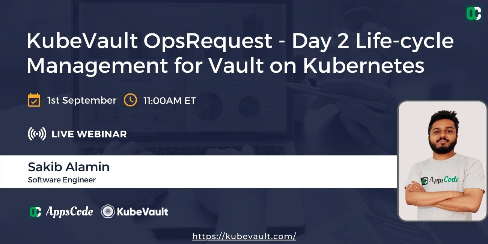

# AppsCode Webinar 07-20-22

<p class="has-text-centered">
  
</p>

# KubeVault OpsRequest - Day 2 Life-cycle Management for Vault on Kubernetes

---

## Install KubeVault Enterprise operator chart

```bash
$ helm install kubevault appscode/kubevault \
    --version v2022.06.16 \
    --namespace kubevault --create-namespace \
    --set-file global.license=/path/to/the/license.txt
```

## Deploy VaultServer

```bash
# deploy the vault server
$ kubectl apply -f vaultserver.yaml
```

## Export necessary environment variables

```bash
$ export VAULT_ADDR='https://127.0.0.1:8200'

$ export VAULT_SKIP_VERIFY=true

$ export VAULT_TOKEN=(kubectl vault get-root-token vaultserver vault -n demo --value-only) 
```

## Deploy VaultServer

```bash
$ kubectl apply -f vaultserver.yaml
```

## Create ReconfigureTLS Ops-request

```bash
$ kubectl apply -f reconfigure-tls.yaml
```

## Create ReconfigureTLS Ops-request

```bash
$ kubectl apply -f rotate-tls.yaml
```

## Generate Vault root-token using KubeVault CLI

```bash
$ kubectl vault root-token generate vaultserver -n demo vault

root-token generation successful
generated root-token: hvs.oxEoWs355PYgfs1mv73cxOsc

# verify that the generate token has root privilege
$ vault login $VAULT_TOKEN

Key                  Value
---                  -----
token                hvs.oxEoWs355PYgfs1mv73cxOsc
token_accessor       wLAjrYLymn6KZUILzqhMx37L
token_duration       ∞
token_renewable      false
token_policies       ["root"]
identity_policies    []
policies             ["root"]

```

## Rotate Vault root-token using KubeVault CLI

```bash
$ kubectl vault root-token rotate vaultserver -n demo vault

root-token generation successful
root-token rotation successful

# verify that the root-token is rotated
$ vault login $VAULT_TOKEN

Error authenticating: error looking up token: Error making API request.

URL: GET https://127.0.0.1:8200/v1/auth/token/lookup-self
Code: 403. Errors:

* permission denied


# update the VAULT_TOKEN env variable
$ export VAULT_TOKEN=(kubectl vault root-token get vaultserver vault -n demo --value-only)

# verify that the new token has root privilege

$ vault login $VAULT_TOKEN

Key                  Value
---                  -----
token                hvs.Art4iUulqUHIo98BEY79Utr7
token_accessor       Y5xJenArE40y9o4Ror8Q8Z6O
token_duration       ∞
token_renewable      false
token_policies       ["root"]
identity_policies    []
policies             ["root"]

```