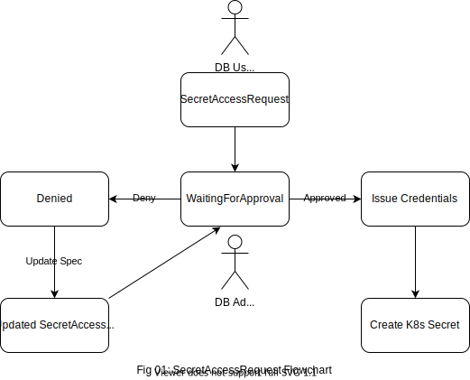
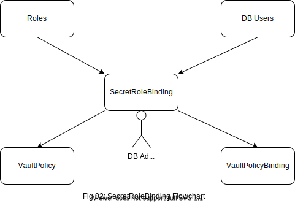

## AppsCode Webinar 10-13-21
<p class="has-text-centered">
  
</p>

### [KubeDB](https://kubedb.com/) Database User Management using [KubeVault](https://kubevault.com/)

---
### install kubedb-enterprise operator
Deploy `KubeDB` enterprise in the `kube-system` namespace.
```bash
$ helm install kubedb appscode/kubedb \
    --version v2021.09.30 \
    --namespace kubedb --create-namespace \
    --set kubedb-enterprise.enabled=true \
    --set kubedb-autoscaler.enabled=true \
    --set-file global.license=/path/to/the/license.txt
```

### install kubevault-enterprise operator
Deploy `KubeVault` enterprise in the `kube-system` namespace.
```bash
$ helm install kubevault appscode/kubevault \
    --version v2021.10.11 \
    --namespace kubevault --create-namespace \
    --set-file global.license=/path/to/the/license.txt
```

### install secrets-store csi driver
Deploy the secrets-store CSI driver in the `kube-system` namespace.
```bash
$ helm install csi-secrets-store secrets-store-csi-driver/secrets-store-csi-driver --namespace kube-system
```

### install vault csi provider
Deploy the `vault` specific provider in the `kube-system` namespace.
```bash
# using helm
$ helm install vault hashicorp/vault \
      --set "server.enabled=false" \
      --set "injector.enabled=false" \
      --set "csi.enabled=true"
     
# or using provider yaml
$ kubectl apply -f vault-csi-provider.yaml
```

### deploy vaultserver (Persona - Vault Admin)

```bash
$ kubectl apply -f vaultserver.yaml
```

### deploy mongodb (Persona - DB Admin)
```bash
$ kubectl apply -f mongodb.yaml
```

### enable mongodb secretengine (Persona - DB Admin)

```bash
$ kubectl apply -f secretengine.yaml
```

### create mongodb secretengineroles (Persona - DB Admin)

```bash
# create the readOnly role
$ kubectl apply -f reader-role.yaml

# create the readWrite role
$ kubectl apply -f reader-writer-role.yaml
```

### create secretaccessrequest (Persona - DB User)
<p class="has-text-centered">
  
</p>

```bash
# create the readWrite access request
$ kubectl apply -f read-write-access-req.yaml

# create the read access request
$ kubectl apply -f read-access-request.yaml
```

### approve/deny the incoming secretaccessrequest (Persona - DB Admin)
```bash
# approve secret access request
# upon approval of request, dynamic secrets will be generated
$ kubectl vault approve secretaccessrequest read-write-access-req -n <namespace>

# deny secret access request
$ kubectl vault deny secretaccessrequest read-write-access-req -n <namespace>
```

### use the dynamic secrets generated to log into the DB (Persona - DB User)
```bash
# export base-64 decoded username & password as env vars
# using the mongo shell to communicate with DB, port-forward from mongodb svc beforehand
$ mongo <db-name> -u $USERNAME -p $PASSWORD

# try to read-write some data into the DB
$ db.<schema-name>.insertOne({"key": "value"})
$ db.<schema-name>.find()
```

### create the service account that will be used to read secrets from vault (Persona - DB User)
```bash
$ kubectl apply -f serviceaccount.yaml
```

### create secretrolebinding to bind a set of roles to a set of users (Persona - DB Admin)
<p class="has-text-centered">
  
</p>

```bash
# upon successful secretrolebinding kubevault operator will create vaultpolicy & vaultpolicybinding
$ kubectl apply -f secretrolebinding.yaml
```

### create secretproviderclass (Persona - DB User)
**SecretProviderClass** is a namespaced resource in Secrets Store CSI Driver that is used to provide driver configurations and provider-specific parameters to the CSI driver.

```bash
$ kubectl apply -f secretproviderclass.yaml
```

### create pod & inject secrets into it (Persona - DB User)
Create the pod `demo-app` that will need the `username` & `password` to mount the volume to the specified path inside the pod & only then the pod will start running.
```bash
$ kubectl apply -f pod.yaml
```
