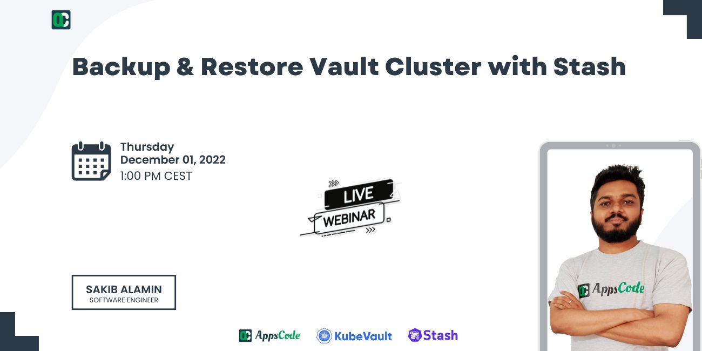

# AppsCode Webinar 12-01-22

<p class="has-text-centered">
  
</p>

# Backup & Restore Vault cluster with Stash

---

## Install Stash Enterprise operator chart

```bash
$ helm install stash appscode/stash \
  --version v2022.09.29 \
  --namespace stash --create-namespace \
  --set features.enterprise=true \
  --set-file global.license=/path/to/the/license.txt
  
```

## Install KubeVault Enterprise operator chart

```bash
$ helm install kubevault appscode/kubevault \
    --version v2022.11.30 \
    --namespace kubevault --create-namespace \
    --set-file global.license=/path/to/the/license.txt
```

## Deploy TLS Secured VaultServer

```bash
# create the issuer
$ kubectl apply -f issuer.yaml

# deploy the vault server
$ kubectl apply -f vaultserver.yaml
```

## Export necessary environment variables

```bash
$ export VAULT_ADDR='https://127.0.0.1:8200'

$ export VAULT_SKIP_VERIFY=true

$ export VAULT_TOKEN=(kubectl vault get-root-token vaultserver vault -n demo --value-only) 
```

## Enable KV SecretEngine & Write some data

```bash
# enable kv secret engine
$ vault secrets enable kv

# write data
$ vault kv put kv/name name=appscode
```

## Create Backup & Restore Repository

```bash
$ kubectl apply -f repository.yaml
```

## Create BackupConfiguration

```bash
# this will create a backup session at time interval set in the spec
$ kubectl apply -f backup-configuration.yaml
```

## Trigger a backup session using Stash CLI

```bash
# optionally a backup session can be triggered using stash cli
# successful backup session will save the snapshot in the repository
$ kubectl stash trigger demo-backup -n demo
```

## Delete KV Secret Engine

```bash
$ vault secrets disable kv
```

## Restore snapshot into Vault

```bash
# successful restore session will restore the vault data
$  kubectl apply -f restore-session.yaml
```

## Delete & Deploy a new VaultServer 

```bash
$ kubectl delete -f vaultserver.yaml
$ kubectl apply -f vaultserver.yaml
```

## Run another Restore Session 

```bash
# edit the restore session to make the -force=true to forcefully restore the snapshot
$ kubectl apply -f restore-session.yaml
```


