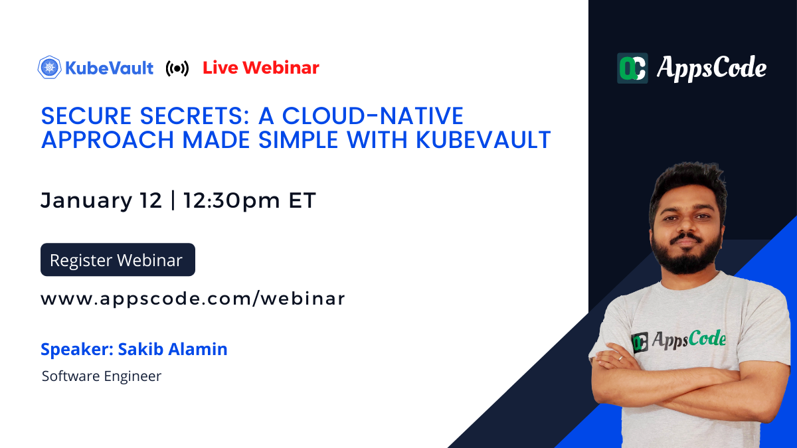

# AppsCode Webinar 12-01-22

<p class="has-text-centered">
  
</p>

# Secure Secrets: A Cloud-Native Approach Made Simple With KubeVault

---

## Install KubeDB Enterprise operator chart

```bash
$ helm install kubedb appscode/kubedb \
    --version v2021.12.21 \
    --namespace kubedb --create-namespace \
    --set kubedb-enterprise.enabled=true \
    --set kubedb-autoscaler.enabled=true \
    --set-file global.license=/path/to/the/license.txt
```

## Install KubeVault Enterprise operator chart

```bash
$ helm install kubevault appscode/kubevault \
    --version v2022.01.11 \
    --namespace kubevault --create-namespace \
    --set-file global.license=/path/to/the/license.txt
```

## Install Secret-store CSI Driver

```bash
$ helm install csi-secrets-store secrets-store-csi-driver/secrets-store-csi-driver --namespace kube-system
```

## Install Vault specific CSI Provider

```bash
# using helm
$ helm install vault hashicorp/vault \
    --set "server.enabled=false" \
    --set "injector.enabled=false" \
    --set "csi.enabled=true"
     
# or using provider yaml
$ kubectl apply -f provider.yaml
```

## Deploy TLS Secured VaultServer

```bash
# create the issuer
$ kubectl apply -f issuer.yaml

# deploy the vault server
$ kubectl apply -f vaultserver.yaml
```

## Export necessary environment variables

```bash
$ export VAULT_ADDR='https://127.0.0.1:8200'

$ export VAULT_SKIP_VERIFY=true

$ export VAULT_TOKEN=(kubectl vault get-root-token vaultserver vault -n demo --value-only) 
```

## Get decrypted Vault Root Token

```bash
# get the decrypted root token with name
$ kubectl vault get-root-token vaultserver vault -n demo

# get only the value of decrypted root token
$ kubectl vault get-root-token vaultserver vault -n demo --value-only
```

## Enable MySQL SecretEngine

```bash
# create mysql DB 
$ kubectl apply -f mysql.yaml

# enable secret engine
$ kubectl apply -f secretengine.yaml
```

## Create Database Roles

```bash
# create the superuser role
$ kubectl apply -f superusr-role.yaml

# create the readonly role
$ kubectl apply -f readonly-role.yaml
```

## Create SecretAccessRequest

```bash
$ kubectl apply -f secretaccessrequest.yaml
```

## Approve/Deny SecretAccessRequest

```bash
# upon approval of secret access request, secrets with username/password will be created
$ kubectl vault approve secretaccessrequest mysql-cred-req -n dev

# deny secret access request
$ kubectl vault deny secretaccessrequest mysql-cred-req -n dev
```
## Secure Microservice using Dynamic Secrets
This microservice will use the dynamically generated credentials (username, password) which will be mounted on the provided directory & these credentials bound the users to the specific roles in the database.

## Create ServiceAccount & SecretRoleBinding

```bash
# create the service account
$ kubectl apply -f serviceaccount.yaml

# create the secret role binding
$ kubectl apply -f secretrolebinding.yaml
```

## Create SecretProviderClass using KubeVault CLI

```bash
# Generate secretproviderclass for the MySQL username and password
$ kubectl vault generate secretproviderclass vault-db-provider -n test      \
    --secretrolebinding=dev/secret-r-binding \
    --vaultrole=MySQLRole/readonly-role \
    --keys username=sql-user --keys password=sql-pass -o yaml 
```

## Deploy the Microservice 

```bash
# create a microservice deployment
$ kubectl apply -f microservice.yaml
```

## Revoke the SecretAccessRequest

```bash
$ kubectl vault revoke secretaccessrequest mysql-cred-req -n dev
```

## Delete the VaultServer

```bash
# TerminationPolicy WipeOut will clean-up the unseal keys & root token 
$ kubectl delete -f vaultserver.yaml
```

## MySQL Queries

```bash
# login as the root user
$ mysql -uroot -p$MYSQL_ROOT_PASSWORD

# loging using the username, password
$ mysql -u <username> -p

# show the databases
$ show databases;

# use the <db-name>
$ use <db-name>;

# show tables
$ show tables;

# create a table with name product with column <id, name, price>
$ create table product(id int, name varchar(100), price float);

# insert values into product table
$ insert into product(id, name, price) values(1, "pen", 3.5);
$ insert into product(id, name, price) values(2, "book", 7.5);

# select everything from the product table
$ select * from product;
```